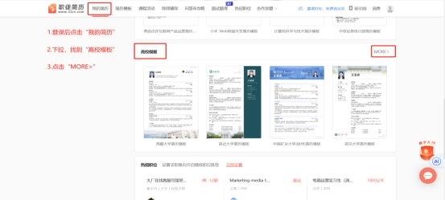
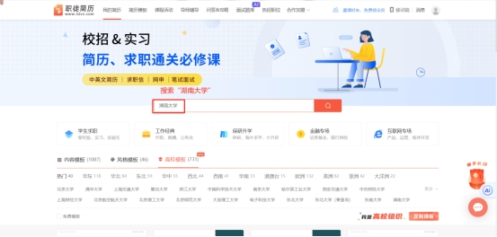
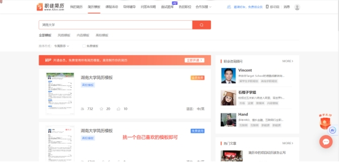
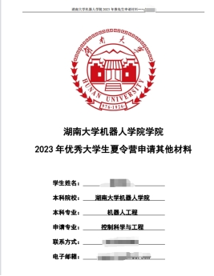
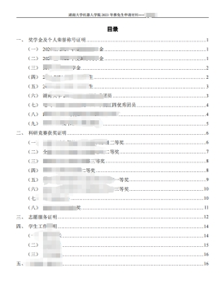

# 郭宇欣

## **1.** 分享人介绍

郭宇欣

保研排名：3/58

四六级成绩：568（四级）、499（六级）

竞赛：2022年百度智能汽车竞赛全国总决赛二等奖

## **2.** 保研材料文书准备

### 2.1 个人简历

夏令营正式开始报名前差不多就可以准备了。准备不超过一页的pdf简历，避免使用花哨的模板，简洁大方即可。

推荐简历制作工具有：职徒简历（https://www.52cv.com/）（这上面有湖大的模板简历）、canva可画（做简历、海报之类的比较自由，但是想要做得简洁美观对审美要求可能较高）。

职徒简历高校模板简历创步骤：

### 2.2联系老师的邮件

夏令营正式开始报名前差不多就可以开始联系老师了。

联系邮件需要按信件格式书写，注意称呼、礼貌问题。

### 2.3报名佐证材料

夏令营报名通知后开始准备就可以了。需要注意几点内容。

第一，证书扫描件要清晰、统一，推荐到打印店里扫描，尽量避免自己拍照。

第二，要严格按照报名通知要求来准备。

第三，推荐为佐证材料加封面、目录，方便阅览。

下面的图片是我投递夏令营时的材料封面与目录，可供各位同学参考。

## 3. 夏令营预推免经验介绍分享

​	夏令营时，我其实投递了很多院校，但是有大部分的学校都没能入营，只有湖南大学（offer）、国防科技大学（offer）、电子科技大学（时间冲突，未参营）、东南大学（offer）入营了。我没有预推免经验。

### 3.1湖南大学-机器人学院

#### 7月3日-7月4日，线下，首先是2分钟（好像？）的英文自我介绍，随后是英文交流，我被问到的问题是“参与的这么多项目中，哪个项目你最感兴趣，为什么？”再接下来就是中文的、针对简历内容的交流。

### 3.2 国防科技大学-智能科学学院

7月10日-7月14日，线下，持续时间较长，宣讲和面试都在酒店报告厅举行，中途有一天会去参观国防科技大学。面试时，首先是3分钟的自我介绍（中英文不限），随后是一个英文问答。我被问到的是“你对未来有什么规划吗？”接下来是针对简历内容的提问，还被问到了参观时对哪个项目最感兴趣，这个项目的痛点难点在哪里。所以大家在参观的时候也要注意听讲，并且可以思考一下。最后是一个专业课程问题，我被问到的是信号“（前面好像有些修饰词）系统的激励响应是什么？”

### 3.3 东南大学-自动化学院

8月3日-8月4日，线下。第一天听宣讲和参观，第二天面试。东南大学的夏令营和预推免是一起的，开的时间也比较晚。面试时，首先是5分钟的PPT自我介绍，紧接着就是抽5道题目进行回答，涉及范围较广，需要大家提前做好复习。我抽到的题目涉及到了数电（CMOS和TTL的区别）、自控（超前、滞后校正）、线代（正定矩阵），其他题没有印象了。最后就是针对PPT和简历内容进行提问。没有英语环节。

## 4. 保研过程中要注意的点或者要避免踩的坑

第一，一定要稳住心态。感觉在夏令营前期特别容易焦虑，外界媒体的干扰，自己的屡屡受挫，都会对自身的自信心造成干扰。要保持好节奏，有些媒体很会制造焦虑，不要全信。

第二，注意材料要分类整理妥当，可以在文件命名时，加上重要的时间节点或通知方式。

我的分享就到这儿啦，时间久远，感触已经没那么深了。希望各位学弟学妹保研/考研顺利。