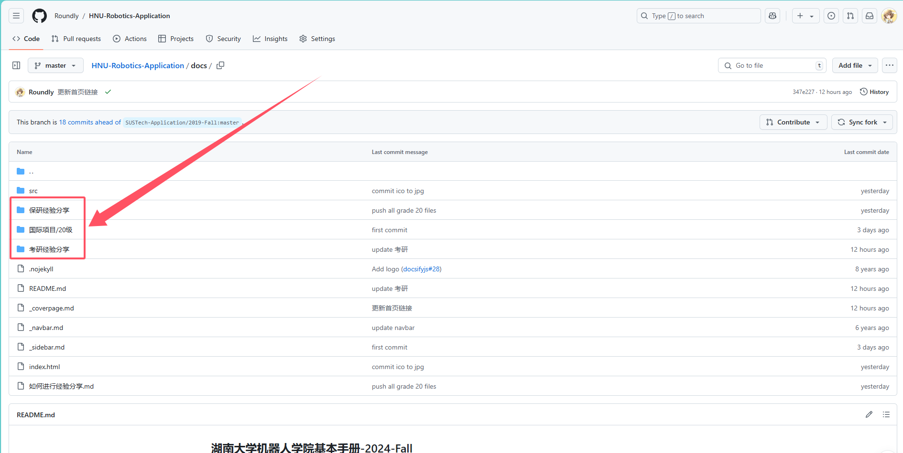
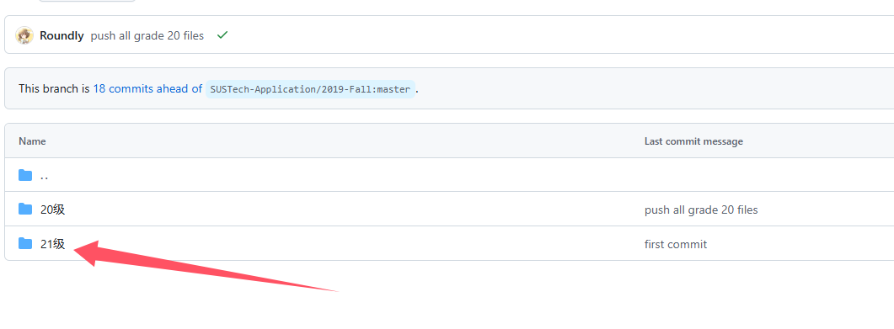
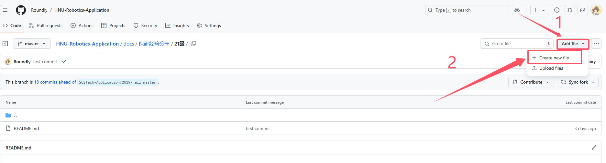
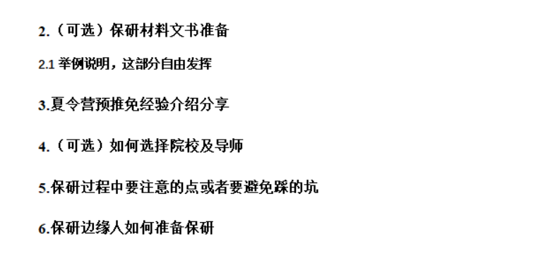

## 如何进行经验分享

1. 如果已有`Github`账号可以跳过此步。打开[Github](https://github.com)，点击`Sign Up`按钮注册一个`Github`账号，选择`Free Plan`即可。

2. 登陆后进入[这个页面](https://github.com/Roundly/HNU-Robotics-Application/tree/master/docs)，打开一个你希望分享的页面，如``保研经验分享``->``21级``，这篇文章将会一直以此为例进行说明。





3. 点击`Create new file`按钮。



命名方式为：`姓名-最终去向.md`。
如：`盛杨钢-xx大学.md`。


将你想要分享的内容填写在下方。我们在此提供模板，同学们只需要改动其中的汉字部分即可，点击`Preview`按钮可以进行预览。

```markdown
# 盛杨钢-保研心得/如何唤醒一头牛/我命油我不油天（自己取标题即可，自由发挥）

## 基本背景

> GPA 0.00/4.00或核心加权排名
> 四六级分数：
> 竞赛获奖经历：
> 如果有科研或者项经历可以简单叙述

## 申请结果

最终录取学校：学校名称+项目名称

其他录取结果：

* **Offer\(0\):**
  * \[学校名称+项目名称\] 若干
* **AD\(0\):**
  * \[学校名称+项目名称\] 若干
* **Rej\(10\)**:
  * \[学校名称+项目名称\] 若干

## 申请心得
申请心得可以从各种方面来介绍，详情见下面的图片
```



4. 点击`Propose new file`按钮。


5. 点击`Create pull request`按钮。


6. 确保`Allow edits from maintainers`是被选中状态，点击`Create pull request`按钮。


7.大功告成。

首先请我们代表学弟学妹们，感谢你愿意分享自己宝贵的经历，同时我们也要感谢你选择了自食其力的方式，这为我们节省了大量格式转换的时间，现在我们只需专注于修改、审核即可。同时我们要恭喜你拥有了自己的`Github`账号并且了解了`.md`也就是`Markdown`这种神奇的事物。希望这个账号不会就此荒废，因为`Github`是这个世界上最富饶的代码库，你几乎可以找到任何你想要的东西。

最后，祝前程似锦。
